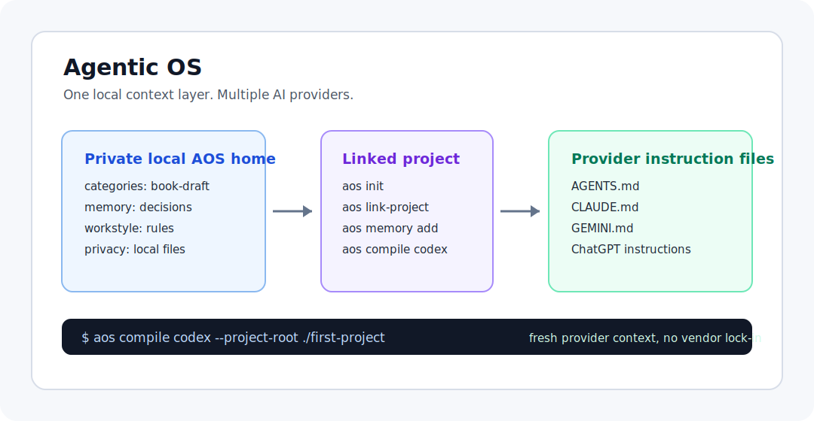

# Agentic OS

[](https://github.com/Dai202703/agentic-os-public-alpha/actions/workflows/test.yml)
[](https://github.com/Dai202703/agentic-os-public-alpha/releases)
[](LICENSE)

Agentic OS is a local-first, blank-canvas context and memory system for AI-assisted work. It keeps reusable context, decisions, and provider instruction files outside any single AI vendor, so the same working setup can support Codex, Claude Code, Gemini, ChatGPT, and future provider adapters.

The core idea is simple: choose the categories that match your work, save the context you want AI tools to remember, and compile that context into the provider file your tool already reads.

This repository is prepared as a public alpha. The default design keeps private identity, project memory, client context, API keys, and generated provider outputs outside the shareable source package.

## AOS At A Glance



## What It Does

- Initializes a local Agentic OS home, normally `~/.agentic-os`
- Links projects to reusable context files
- Compiles provider instruction files for supported AI tools
- Records session and decision memory in local Markdown files
- Checks project readiness, generated output freshness, and private data risks
- Runs public-release audit, export, and release gates
- Verifies first-user install, onboarding, and memory recovery in isolated temporary folders
- Provides safe install, update, and rollback helpers for the global `aos` command

## Five-Minute Start

```bash
git clone https://github.com/Dai202703/agentic-os-public-alpha.git
cd agentic-os-public-alpha
sh scripts/install.sh
aos init
mkdir -p /tmp/aos-first-project
aos link-project --project-root /tmp/aos-first-project --id first-project --name "First Project" --provider codex
aos memory add session --project-id first-project --title "First memory" --summary "Use AOS to keep reusable AI context outside one vendor."
aos compile codex --project-root /tmp/aos-first-project
```

That flow installs `aos`, creates your private OS home, links one folder, saves one memory, and compiles a Codex `AGENTS.md` provider instruction file.

You do not need to adopt a fixed workflow. AOS gives you a durable place to define your own categories: clients, cases, classes, books, repositories, experiments, campaigns, or anything else you repeatedly ask AI tools to understand.

## Choose Your Own Categories

AOS does not ship a fixed set of work categories. The `--id` you pass to `aos link-project` is your category key, and it can describe the way you actually work: book drafts, client work, research threads, class notes, legal matters, product launches, or internal experiments.

Use short safe identifiers with letters, numbers, hyphens, or underscores:

```bash
aos link-project --project-root /tmp/aos-book --id book-draft --name "Book Draft" --provider chatgpt
aos link-project --project-root /tmp/aos-class --id biology-101 --name "Biology 101" --provider gemini
aos link-project --project-root /tmp/aos-case --id case-research --name "Case Research" --provider claude
```

Avoid spaces, slashes, private client names, and secrets in category IDs. Put sensitive details in your private local memory, not in public docs, issue reports, or shared screenshots.

If you are new to command line tools, start with [Install AOS For Beginners](docs/install-for-beginners.md).

## Five Ways To Use AOS

Each example below uses the same pattern: link a folder, record the important memory, then compile provider instructions before working with an AI assistant.

### Writer

Use AOS as a continuity layer for long-form writing.

- Category to create: `book-draft`, `newsletter`, or `script-series`
- Memory to save: audience, voice, outline decisions, rejected angles, unresolved edits
- Provider output to compile: ChatGPT for drafting, Codex for repo-backed publishing workflows

```bash
aos link-project --project-root /tmp/aos-writer --id book-draft --name "Book Draft" --provider chatgpt --provider codex
aos memory add session --project-id book-draft --title "Chapter direction" --summary "Keep chapters practical, example-led, and concise."
aos compile chatgpt --project-root /tmp/aos-writer
```

### Researcher

Use AOS to keep research trails reusable across papers, reports, and exploratory projects.

- Category to create: `market-research`, `paper-review`, or `source-map`
- Memory to save: hypotheses, source quality notes, open questions, synthesis decisions
- Provider output to compile: Claude Code or ChatGPT for long-context review, Codex for structured data workflows

```bash
aos link-project --project-root /tmp/aos-research --id market-research --name "Market Research" --provider claude --provider chatgpt
aos memory add session --project-id market-research --title "Source triage" --summary "Separate primary sources, analyst commentary, and unverified claims."
aos compile claude --project-root /tmp/aos-research
```

### Student

Use AOS as a study operating notebook that survives across classes and AI tools.

- Category to create: `biology-101`, `exam-prep`, or `thesis-notes`
- Memory to save: syllabus priorities, weak topics, instructor preferences, study plans
- Provider output to compile: ChatGPT or Gemini for tutoring and review sessions

```bash
aos link-project --project-root /tmp/aos-study --id exam-prep --name "Exam Prep" --provider chatgpt --provider gemini
aos memory add session --project-id exam-prep --title "Weak topics" --summary "Prioritize spaced repetition for cell signaling and genetics problems."
aos compile gemini --project-root /tmp/aos-study
```

### Lawyer

Use AOS to organize private matter context without publishing client-sensitive material.

- Category to create: `matter-notes`, `contract-review`, or `case-research`
- Memory to save: procedural posture, issue lists, research boundaries, drafting preferences
- Provider output to compile: Claude Code or ChatGPT for private review workflows

```bash
aos link-project --project-root /tmp/aos-matter --id matter-notes --name "Matter Notes" --provider claude --provider chatgpt
aos memory add session --project-id matter-notes --title "Review scope" --summary "Track open issues, cited authority, and non-public facts separately."
aos compile chatgpt --project-root /tmp/aos-matter
```

### Developer

Use AOS to make every AI coding session start with the same project rules and recent decisions.

- Category to create: `product-mvp`, `infra-upgrade`, or `bug-bash`
- Memory to save: architecture decisions, test commands, release risks, known constraints
- Provider output to compile: Codex, Claude Code, Gemini, or ChatGPT depending on the tool you are using

```bash
aos link-project --project-root /tmp/aos-dev --id product-mvp --name "Product MVP" --provider codex --provider claude --provider gemini --provider chatgpt
aos memory add session --project-id product-mvp --title "Release rule" --summary "Run targeted tests first, then full unittest before release."
aos compile codex --project-root /tmp/aos-dev
```

## Public Alpha Scope

The public alpha is intentionally small and file-based. It does not run a background service, sync private data, or require a hosted account.

Supported provider outputs:

- Codex: `AGENTS.md`
- Claude Code: `CLAUDE.md`
- Gemini: `GEMINI.md`
- ChatGPT: `.agentic-os/chatgpt-project-instructions.md`

## Standalone Install

Clone the public alpha repository and run the verified installer:

```bash
git clone https://github.com/Dai202703/agentic-os-public-alpha.git
cd agentic-os-public-alpha
```

macOS, Linux, or Windows through WSL:

```bash
sh scripts/install.sh
```

Native Windows PowerShell:

```powershell
powershell -ExecutionPolicy Bypass -File scripts\install.ps1
```

`scripts/install.sh` runs the test suite, runs the repo-contained readiness smoke, installs `bin/aos` as a symlink under `~/.local/bin`, prints `aos version`, and verifies the installed command against a temporary OS home. It does not initialize or copy private data into your live `~/.agentic-os` home.

`scripts/install.ps1` provides the native Windows PowerShell installer. It creates `aos.cmd` and `aos.ps1` launchers, runs Windows-compatible checks, and prints PATH guidance. By default it installs under your user app-data folder when available. It only changes the User PATH when you pass `-AddToUserPath`.

CI also runs `scripts/windows_install_smoke.py` on `windows-latest` to verify the PowerShell installer, both generated launchers, version output, and rollback.

Use `AOS_INSTALL_DIR` when you want to install somewhere else:

```bash
AOS_INSTALL_DIR=/tmp/aos-bin sh scripts/install.sh
```

PowerShell equivalent:

```powershell
$env:AOS_INSTALL_DIR="$env:TEMP\aos-bin"; powershell -ExecutionPolicy Bypass -File scripts\install.ps1
```

PowerShell rollback:

```powershell
powershell -ExecutionPolicy Bypass -File scripts\install.ps1 -Rollback
```

For lower-level symlink-based installs, updates, and rollbacks:

```bash
PYTHONPATH=src python3 -m unittest discover -s tests -v
python3 scripts/manage_global_aos.py install --launcher bin/aos --install-dir ~/.local/bin
aos version
aos doctor --summary
```

Rollback:

```bash
python3 scripts/manage_global_aos.py rollback --install-dir ~/.local/bin
```

## Quickstart

Create a private OS home:

```bash
aos init
aos version
aos doctor --summary
```

Link a project:

```bash
aos link-project --project-root /tmp/demo-project --id demo --name "Demo Project" --provider codex --provider claude
```

Compile provider instructions:

```bash
aos compile codex --project-root /tmp/demo-project
aos compile claude --project-root /tmp/demo-project
```

Run the linked project gate:

```bash
aos onboarding-check --project-root /tmp/demo-project --json
```

Record and recover memory:

```bash
aos memory add session --project-id demo --title "Demo Session" --summary "Linked demo project and compiled provider instructions."
aos memory list --project-id demo
aos memory search "compiled provider instructions" --project-id demo
```

For a linked current working directory:

```bash
aos onboarding-check --project-root . --json
```

## Release And Privacy Gates

Recommended v0.1.14 release handoff:

```bash
PYTHONPATH=src python3 -m unittest discover -s tests -v
scripts/readiness_smoke.py --launcher bin/aos --json
aos public-export --repo-root . --output /tmp/agentic-os-public --json
cd /tmp/agentic-os-public
PYTHONPATH=src python3 -m agentic_os public-release-gate --repo-root . --json
PYTHONPATH=src python3 -m agentic_os release-install-smoke --source https://github.com/Dai202703/agentic-os-public-alpha.git --ref v0.1.14-public-alpha --expected-tag v0.1.14-public-alpha --fresh-user-smoke --json
```

Run these from a clean standalone repository before publishing or handing the package to another user:

```bash
aos distribution-check --repo-root . --json
aos public-audit --repo-root . --json
aos release-check --repo-root . --json
aos fresh-user-smoke --repo-root . --json
aos release-check --repo-root . --fresh-user-smoke --json
aos release-upgrade-smoke --repo-root . --from-ref v0.1.13-public-alpha --to-ref HEAD --json
aos public-release-gate --repo-root . --json
aos release-install-smoke --source https://github.com/Dai202703/agentic-os-public-alpha.git --ref v0.1.14-public-alpha --expected-tag v0.1.14-public-alpha --fresh-user-smoke --json
```

Use `aos public-audit --repo-root . --tree-only --json` only for private development or standalone CI repositories whose historical commits are not intended for publication. Public release repositories must run the default full-history audit.
Use `aos release-check --repo-root . --skip-release-manifest --json` only for repositories that are not clean public exports and therefore do not contain `public-release-manifest.json`.

Create a clean public snapshot:

```bash
aos public-export --repo-root . --output /tmp/agentic-os-public --json
```

The gates check for generated provider outputs, live OS home folders, sensitive filenames, API key patterns, private memory references, private local paths, and install rollback failures.
`public-export` writes `public-release-manifest.json` with SHA-256 checksums for exported files.
`release-check` also verifies that code version metadata, `pyproject.toml`, and the top `CHANGELOG.md` release heading agree, and that the release manifest checksum gate passes.
`fresh-user-smoke` verifies an isolated install, temporary OS home, temporary project link, all four provider compiles, onboarding check, `memory add session`, filtered `memory list`, and `memory search` without touching the live OS home or global command. When it fails, JSON and summary output include the failed command, output tails, and a `next_action`.
For release managers, `release-upgrade-smoke` verifies the previous public alpha can be installed, updated to the current ref, and rolled back in an isolated temporary install directory.
`public-release-gate` is the canonical public release command. It runs full-history `public-audit` and strict `release-check` with manifest, fresh-user memory smoke, and upgrade smoke enabled. When `--from-ref` is omitted, it infers the previous public-alpha tag from git tags.
After a public tag exists, `release-install-smoke` verifies the published source can be fetched by tag, installed into a temporary command path, and checked with `aos version --json`. Add `--fresh-user-smoke` for the public handoff gate when you want the fetched tag to prove the full first-user workflow too. Use it as a post-tag/public-source smoke, not as a replacement for the local pre-release gate.

## Development

Run from the repository root:

```bash
PYTHONPATH=src python3 -m unittest discover -s tests -v
scripts/readiness_smoke.py --launcher bin/aos --json
```

Run the CLI without installing:

```bash
PYTHONPATH=src python3 -m agentic_os --os-home /tmp/aos-demo init
PYTHONPATH=src python3 -m agentic_os --os-home /tmp/aos-demo doctor
```

## Privacy Model

Shareable source code, provider templates, tests, scripts, and docs belong in this repository.

Private local data belongs in the user's OS home, normally `~/.agentic-os`.

Do not publish:

- Personal identity files from a live OS home
- Private memory
- API keys
- Client-sensitive project state
- Generated provider outputs from private projects
- Machine-specific local paths from a private install

## Documentation

- [Install AOS For Beginners](docs/install-for-beginners.md)
- [Operations](docs/operations.md)
- [Distribution](docs/distribution.md)
- [Public release policy](docs/public-release.md)
- [Security policy](SECURITY.md)
- [Contributing](CONTRIBUTING.md)
