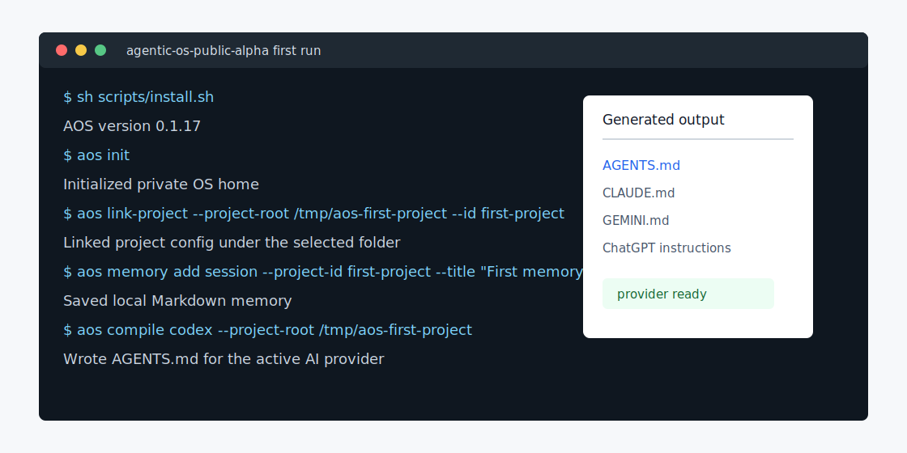

# Agentic OS Demo

This public-safe demo uses disposable `/tmp` folders and placeholder project IDs.



## First Run

macOS, Linux, or WSL:

```bash
git clone https://github.com/Dai202703/agentic-os-public-alpha.git
cd agentic-os-public-alpha
sh scripts/install.sh
aos init
mkdir -p /tmp/aos-first-project
aos link-project --project-root /tmp/aos-first-project --id first-project --name "First Project" --provider codex --provider claude --provider gemini --provider chatgpt
aos memory template session --project-id first-project
aos memory add session --project-id first-project --title "First memory" --summary "Use AOS to keep reusable AI context outside one vendor."
aos compile codex --project-root /tmp/aos-first-project
aos onboarding-check --project-root /tmp/aos-first-project --json
```

Native Windows PowerShell:

```powershell
git clone https://github.com/Dai202703/agentic-os-public-alpha.git
cd agentic-os-public-alpha
powershell -ExecutionPolicy Bypass -File scripts\install.ps1
aos init
```

The result is a private local AOS home, one linked disposable project, one memory entry, and provider instructions such as `AGENTS.md`.
